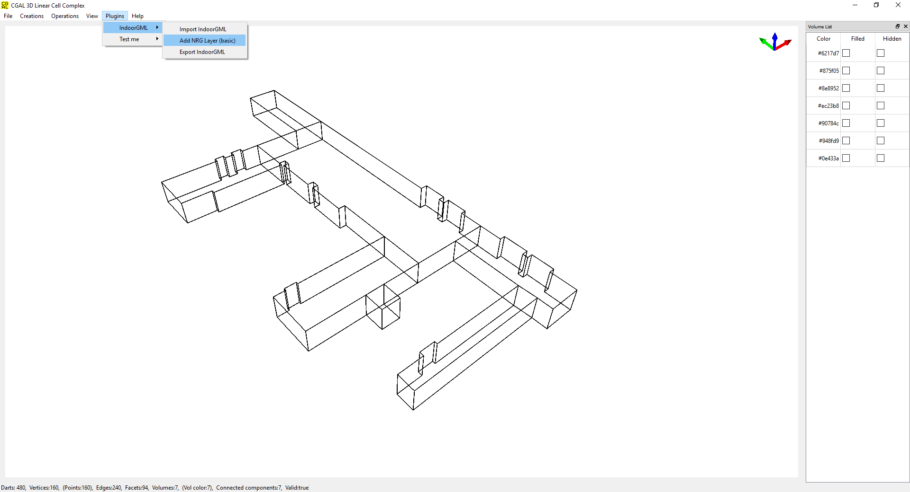

# IndoorGML2LCC
Processing IndoorGML as a Linear Cell Complex (LCC) class of CGAL

This project contains C++ code that generates a plugin dedicated to the [Linear Cell Complex (LCC)](https://doc.cgal.org/latest/Linear_cell_complex/index.html#Chapter_Linear_Cell_Complex) demo of [CGAL](https://www.cgal.org/). allows to import an [IndoorGML](http://www.indoorgml.net/) files, convert its goemetry and topology into LCC (CellSpace elements becomes 3-cells, connected 3-cells are 3-sewn through their shared faces, etc). Furthermore, it can generate a simple Node Relation Graph (NRG), as described in the IndoorGML standard and export IndoorGML files that include the newly generated NRG layers. The plugin is directly connected to the viewer of the LCC demo so that the IndoorGML can be visualized. 

## Installation
1. First of all, you need to download and install the latest version of [CGAL](https://www.cgal.org/download.html) and follow the [installation instructions](https://doc.cgal.org/latest/Manual/installation.html) (you don't have to include the demos in the installation, but make sure you add properly the environment variables such as CGAL_DIR, etc.).
1. Get the Linear Cell Complex demo from [this repository](https://github.com/gdamiand/cgal/tree/LCC_demo-gdamiand) (not yet in the official repository of CGAL). 
1. Put all the files of this project in the folder (e.g. IndoorGML2LCC) and put that folder in the **Plugins** folder of the demo.
1. Compile the CMakeLists.txt of the demo
1. That's it. You should find the IndoorGML2LCC plugin button on the GUI of the LCC demo.

